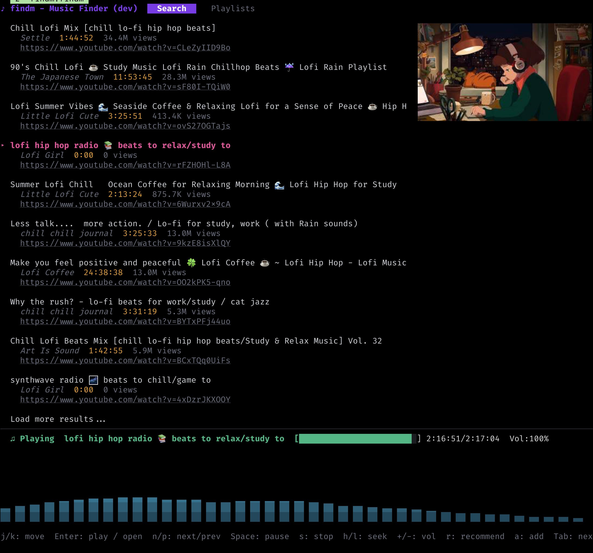

# findm



YouTube 기반 터미널 음악 검색 및 재생 도구.

터미널에서 음악을 검색하고, 추천받고, 바로 재생할 수 있는
TUI 인터페이스를 제공합니다.

## 사전 요구 사항

- [Go](https://go.dev/) 1.21+
- [mpv](https://mpv.io/) - 오디오 재생 엔진
- [yt-dlp](https://github.com/yt-dlp/yt-dlp) - YouTube 검색 및 메타데이터 추출

### mpv 설치

```bash
# macOS
brew install mpv

# Ubuntu/Debian
sudo apt install mpv

# Arch Linux
sudo pacman -S mpv
```

### yt-dlp 설치

```bash
# macOS
brew install yt-dlp

# pip (모든 플랫폼)
pip install yt-dlp
```

## 설치

```bash
go install github.com/ysoftman/findm@latest
```

소스에서 빌드:

```bash
git clone https://github.com/ysoftman/findm.git
cd findm
go build -o findm .
```

버전을 지정하여 빌드:

```bash
go build -ldflags "-X main.Version=1.0.0" -o findm .
```

버전을 지정하지 않으면 타이틀에 `dev`로 표시됩니다.
GitHub에서 태그를 push하면 GitHub Actions가
해당 태그명으로 자동 빌드하여 Release에 바이너리를 첨부합니다.

## 실행

```bash
./findm
```

## 데이터 저장 경로

| 파일 | 경로 | 설명 |
|------|------|------|
| 설정 파일 | `~/.config/findm/config.json` | API 키 등 설정 (선택, yt-dlp 사용 시 불필요) |
| 플레이리스트 | `~/.config/findm/playlists/*.json` | 저장된 플레이리스트 목록 |

설정 디렉토리는 `$XDG_CONFIG_HOME/findm/`을 따르며,
미설정 시 `~/.config/findm/`이 기본값입니다.

## 라이선스

MIT
